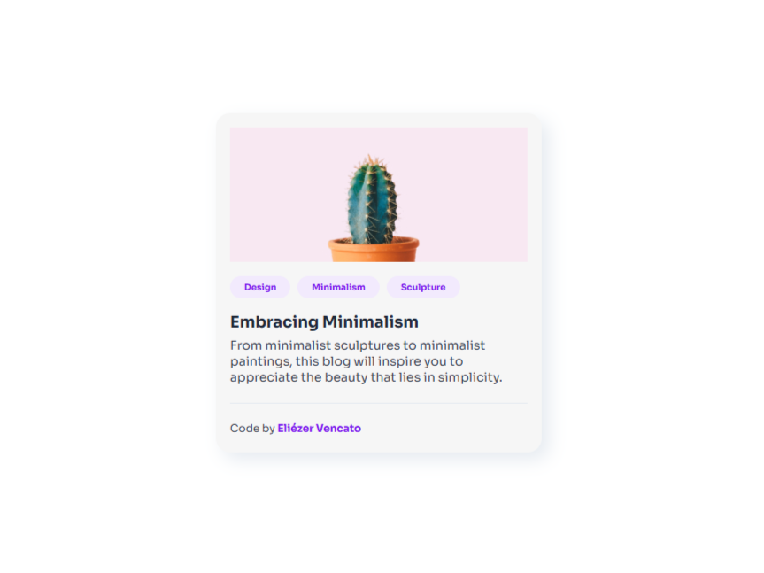

<h1 align="center">Minimal Card Challenge</h1>

## Overview

Este projeto é um desafio do site DevChallenges. O desafio tinha como objetivo criar um card contendo uma imagem, título, uma breve descrição, campo para tags e nome do autor.

### O que foi utilizado nesse projeto

- HTML5
- CSS
- Flexbox
- Google Fonts

### Features

- Layout responsivo com Flexbox para centralizar o card
- Design clean e minimalista

## Dev

- [LinkedIn](https://www.linkedin.com/in/eliezer-vencato/)
- [Github](https://github.com/eliezervencato)